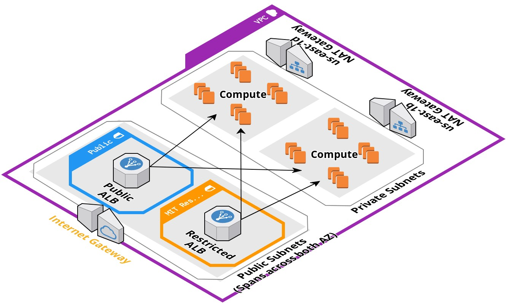

## Network Setup

This folder contains the configuration for our shared network components in AWS. The main components that are created with Terraform are the VPC (Virtual Private Cloud) and the ALBs (Application load balancers). Below is a high-level diagram of a single (e.g. "Stage") VPC with a public ALB and a restricted (to MIT) ALB resource.

### What's actually created?

#### VPC
General:
* 1 VPC per Workspace (Stage/Prod)
* US-EAST-1b and US-EAST-1d availability zones are used
* Each VPC is created with a /16 CIDR block

Network Components per VPC:
* 2 x Private subnets (/24 per subnet) in each AZ
* 2 x Public subnets (/24 per subnet) in each AZ
* 2 x NAT Gateways (allows private subnets egress to Internet) in each AZ
* Internet Gateway (allows access from Internet to VPC)
* S3 VPC Endpoint
* Network ACL
* VPC default security group

_Additional information about each of these components is available from the [AWS User Guide](https://docs.aws.amazon.com/vpc/latest/userguide/VPC_Networking.html)_

#### Application Load balancers
General:
* We currently create 2 ALB's per VPC
  * One with public access (no restrictions)
  * One with restricted access to MIT-Only (18.0.0.0/9)
* Security groups for each ALB
* Each ALB is configured to use the \*.mitlib.net certificate
* Default HTTP and HTTPS (port 80 and 443) listeners and target groups

_Additional information about Application Load Balancers is available from the [AWS User Guide](https://docs.aws.amazon.com/elasticloadbalancing/latest/application/introduction.html)_
